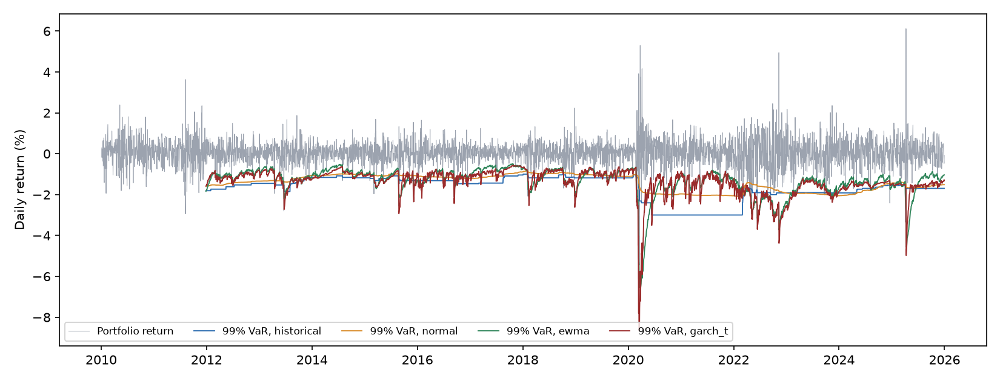
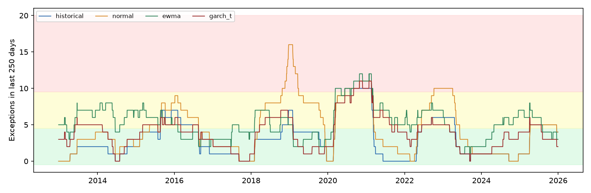

# Value-at-Risk Models and Backtesting

One-day Value-at-Risk (VaR) for a multi-asset ETF portfolio, forecast four ways and backtested over 3,522 trading days with the tests banks and regulators use.

**Result.** No model passed conditional coverage at 99%. Historical simulation matched the 1% exception rate (Kupiec p = .34), but its exceptions clustered in crises (Christoffersen p < .001). GARCH(1,1) with Student-t errors clustered least and spent the fewest days in the Basel red zone (3.5%), yet still had too many exceptions overall (54 against 35 expected). Every model broke during the 2020 COVID crash.



## Portfolio

SPY 40%, TLT 30%, GLD 10%, EFA 10%, VNQ 10% (U.S. stocks, long-term Treasuries, gold, international stocks, real estate), daily returns 2010–2025, rebalanced daily to fixed weights.

## Models

Each forecast uses only returns up to the previous day. Historical, normal, and GARCH estimates use the last 500 days; EWMA weights all past returns with exponential decay:

1. Historical simulation: the empirical quantile of past returns.
2. Parametric normal: rolling mean and standard deviation with a normal quantile.
3. EWMA (RiskMetrics, λ = 0.94): exponentially weighted volatility with a normal quantile.
4. GARCH(1,1) with Student-t errors, refit every 20 days.

## Backtests

1. Kupiec proportion-of-failures test: is the exception rate equal to 1 − confidence?
2. Christoffersen independence test: do exceptions cluster on consecutive days?
3. Conditional coverage: both together.
4. Basel traffic light: exceptions in the last 250 days at 99% (green 0–4, yellow 5–9, red 10+).
5. Stress periods: exceptions during the 2020 COVID crash and the 2022 rate shock.

## Results at 99%

| Model | Exceptions (expected 35) | Kupiec p | Christoffersen p | Days in red zone |
|---|---|---|---|---|
| Historical | 41 | 0.34 | < 0.001 | 5.3% |
| Normal | 61 | < 0.001 | < 0.001 | 12.3% |
| EWMA | 74 | < 0.001 | 0.005 | 6.6% |
| GARCH-t | 54 | 0.003 | 0.001 | 3.5% |

At 95%, historical, normal, and EWMA all matched the 5% exception rate (Kupiec p > .30), and all failed the independence test. EWMA came closest to passing every test (conditional coverage p = .024).

During the 50 trading days of the COVID crash, about 0.5 exceptions were expected at 99%. Historical and normal VaR had 9, and EWMA and GARCH-t had 6. During the 2022 rate shock (2.1 expected), GARCH-t had the fewest exceptions, 5.



## What the results show

- Historical and normal VaR adapt slowly, because a 500-day window gives a crisis little weight at first. Historical VaR matched the expected rate at 99%, and both matched it at 95%, yet their exceptions arrived in clusters.
- EWMA and GARCH-t react faster and cluster less, but understate the tails at 99%. EWMA assumes normal returns, which have thinner tails than daily market returns.
- A natural next step is filtered historical simulation, which pairs GARCH volatility with the empirical shape of past returns.

Full numbers: `results/backtest.csv`, `results/traffic_light.csv`, `results/stress_periods.csv`.

## Reproduce

```
python3 -m venv .venv && source .venv/bin/activate
pip install -r requirements.txt
python -m pytest tests
python -m scripts.run
```

Prices come from Yahoo Finance through `yfinance` and are cached in `data/`.
